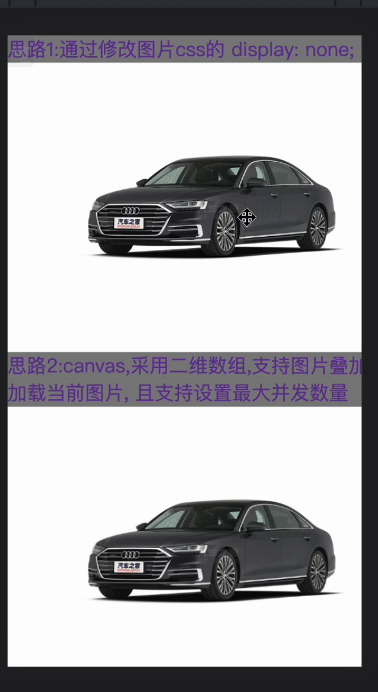

# cycleImageDemo

### Usage:

```
// constructor
SYCycleImage(id, config)
/*
    constructor(id: string, config: {
        width: number,            image width px
        height: number,           image height px
        distance: number,         default: move distance
        maxThread: number,        default: max download column
        defaultIndex: number      default: index
    }
*/
```

```
<div id="cycle-image-wrap"></div>

let imgObj = new SYCycleImage("cycle-image-wrap", { width: 300, height: 200, maxThread: 6, defaultIndex: 5 })

// current index
imgObj.currentIndex

// imageArray: string[] | string[][]
// [img1,img2,...,img35,...] or [[imgA1,imgA2,...,imgA35,...],[imgB1,imgB2,...,imgB35,...]]
imgObj.updateImages(imageArray)

// release
imgObj.destroy()
```


