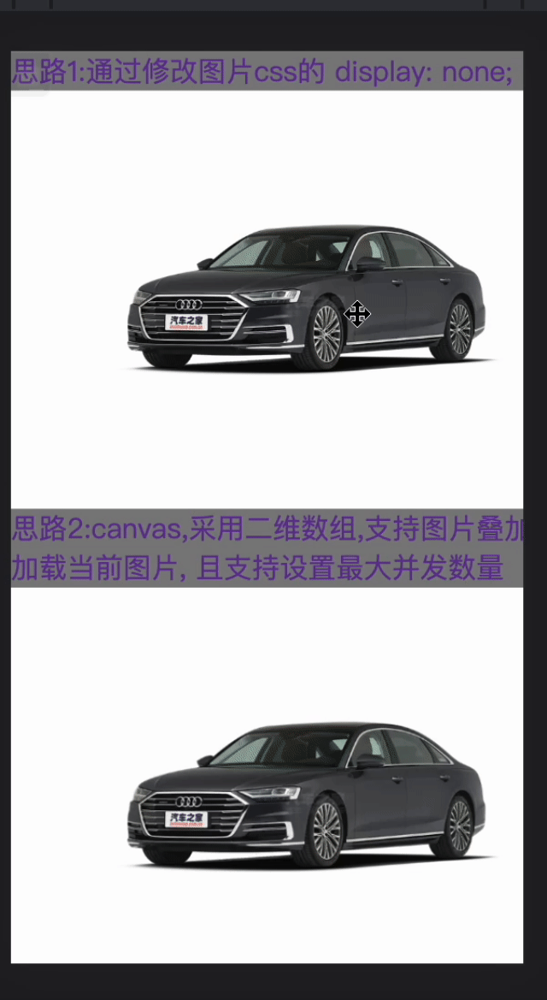

# cycleImageDemo
######Usage:
```
<div id="cycle-image-wrap"></div>

let imgObj = new SYCycleImage("cycle-image-wrap", { width: 300, height: 200, dpi: 1, maxThread: 6, defaultIndex: 5 })
imgObj.updateImages(imageArray)
imgObj.destroy()
```
```
SYCycleImage(id, config)
/*
    constructor(id: string, config: {
        width: number,            canvas width
        height: number,           canvas height
        dpi: number,              default: window.devicePixelRatio
        distance: number,         default: move distance
        maxThread: number,        default: max download column
        defaultIndex: number      default: index
    }
*/
```
```
// imageArray: string[] | string[][]
// [img1,img2,...,img35,...] or [[imgA1,imgA2,...,imgA35,...],[imgB1,imgB2,...,imgB35,...]]   
updateImages(imageArray)
```
```
destroy()
```

